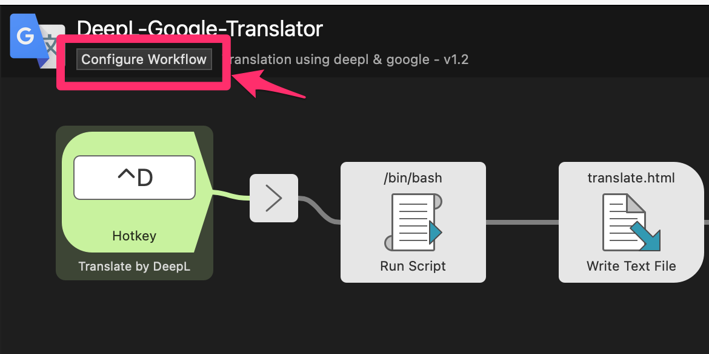

# Alfred workflow DeepL Translation

クリップボード上の英語を日本語にしてブラウザ上に表示する alfred workflow です。
簡易的に作ったものなので不備が多々ありますがご了承ください

DeepLのアプリとは別に開いておきたい＋今後の拡張用途で作りました

### 前提

- alfred Powerpack(有料)
- DeepL API キー(有料 or 無料)  
  DeepL サイトで API キーを取得しておいて下さい。無料アカウントでも大丈夫ですが、月間の使用文字数に制限が出ます
- jq  
  homebrew などでインストールしておいて下さい

### インストール手順

### ダウンロード

[release](https://github.com/shivase/alfred-worlflow-deepl-translation/releases)より DeepL-Translate(EN2JA).alfredworkflow をダウンロードし、alfred にインストールして下さい

#### API キーの登録

alfred のワークフローより、インストールした DeepL-Translate(EN2JA)を選択し、右上の変数コンフィグを選びます

DeepL の API キーを`DEEPL_KEY`へ、 PRO の方は`DEEPL_PRO`に`1`をいれて下さい

#### Hotkey の登録

お好みでホットキーを設定して下さい

### 使い方

クリップボードの値をそのまま変換するので、変換したい文字を選択してクリップボードにコピーし、決めたホットキーを押すだけです。あとは自動的にブラウザが開きます

### やりたいこと・やること

- JA -> EN 変換

### Thanks

html 部分は以下を参考にしています

[【ご紹介】iPad で英論文を爆速超快適に読めるように \.\.\. \- Qiitahttps://qiita\.com › iPad](https://qiita.com/hiro2do/items/43fb123769cd9bb82476)
